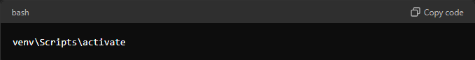
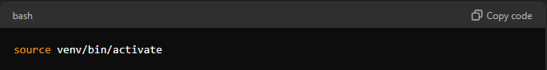
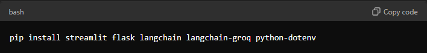
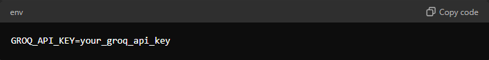
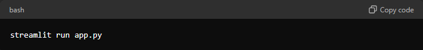

<h1>Groq Chatbot Project Documentation</h1>
<h2>Table of Contents</h2>
<ul style="font-size: 25px;">
    <li style="margin-bottom: 20px;">Setting Up a Virtual Environment</li>
    <li style="margin-bottom: 20px;">Activate the Virtual Environment</li>
    <li style="margin-bottom: 20px;">Install Dependencies</li>
    <li style="margin-bottom: 20px;">Configuration</li>
    <li style="margin-bottom: 20px;">Data Sources</li>
    <li style="margin-bottom: 20px;">How to Run</li>
    <li>Troubleshooting</li>
</ul>

<h2>Overview</h2>

This documentation provides details on setting up and running the chatbot project. The chatbot utilizes the GroqCloud API and the 'llama3-8b-8192' model for generating responses. The primary data is sourced locally from text or PDF files, while additional data can be obtained from external sources.

<h2>Setup</h2>

<h3>1. Setting Up a Virtual Environment</h3>

It's recommended to use a virtual environment to manage the project dependencies. Follow these steps to set up and activate a virtual environment:

<b>Create a Virtual Environment</b>

<h3>2. Activate the Virtual Environment</h3>

<ul>
    <li>On Windows:</li>
</ul>

<ul>
    <li>•On macOS/Linux:</li>
</ul>

<h3>3. Install Dependencies</h3>

To set up the chatbot project, you need to install the following dependencies:

<ol>
    <li>Streamlit - A framework for building interactive web applications.</li>
    <li>Flask - A micro web framework for Python</li>
    <li>LangChain - A library for working with language models.</li>
    <li>LangChain-GROQ - Integration for GroqCloud API with LangChain.</li>
    <li>python-dotenv - A library for managing environment variables.</li>
</ol>

<h3>Installation Commands</h3>

<h3>4. Configuration</h3>

Ensure that your environment variables are set up correctly. The python-dotenv library will load these variables from a .env file.

<h3>Example .env File</h3>

Replace your_groq_api_key with your actual API key.

<h3>API and Model Used</h3>

<ul>
    <li>API: GroqCloud API - <a href="https://console.groq.com/docs/quickstart" target="_blank">Click To Get API</a></li>
    <ul style="list-style-type: square;">
        <li>GroqCloud is a cloud-based AI platform that provides a simple and scalable way to build and deploy AI models.</li>
    </ul>
    <li>Model: 'llama3-8b-8192'</li>
    <ul style="list-style-type: square;">
        <li>'llama3-8b-8192' model is a pre-trained language model that can be used for a variety of natural language processing
        (NLP) tasks.</li>
    </ul>
</ul>

The chatbot uses the GroqCloud API to interface with the 'llama3-8b-8192' model for generating responses based on user input.

<h3>5. Data Sources</h3>

Your chatbot is designed to provide responses primarily based on the content of local text or PDF files. When a question cannot be answered from these local files, the chatbot dynamically searches for answers from external resources to provide the necessary information.

<ul>
    <li>Primary Data: The chatbot retrieves primary data locally from text or PDF files.</li>
    <li>External Data: The chatbot can also incorporate data from external sources.</li>
</ul>

<h3>6. How to Run</h3>

<h3>To run the chatbot application, use the following command:</h3>

This command starts the Streamlit application, which will allow you to interact with the chatbot.

<h3>7. Troubleshooting</h3>

If you encounter issues, ensure all dependencies are installed correctly and environment variables are set up. Verify that the file paths for local data are correct and that the external sources are accessible.

